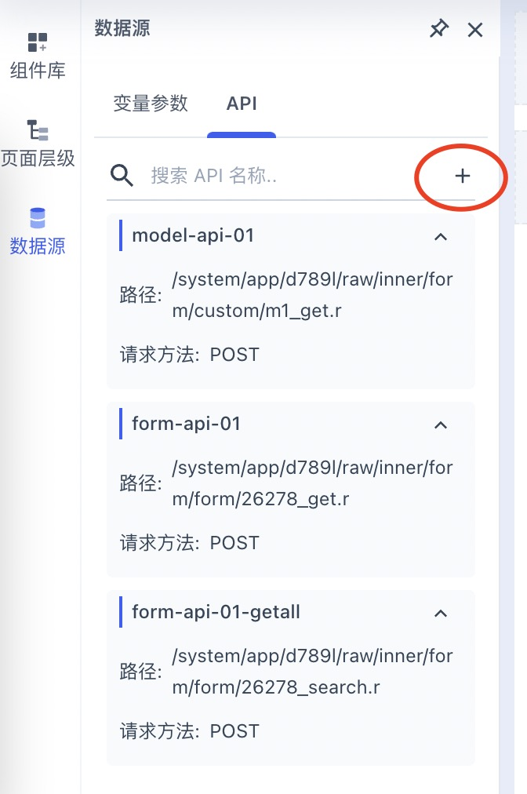
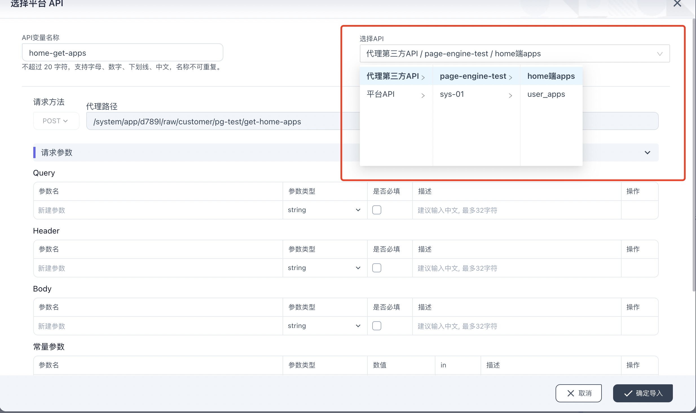
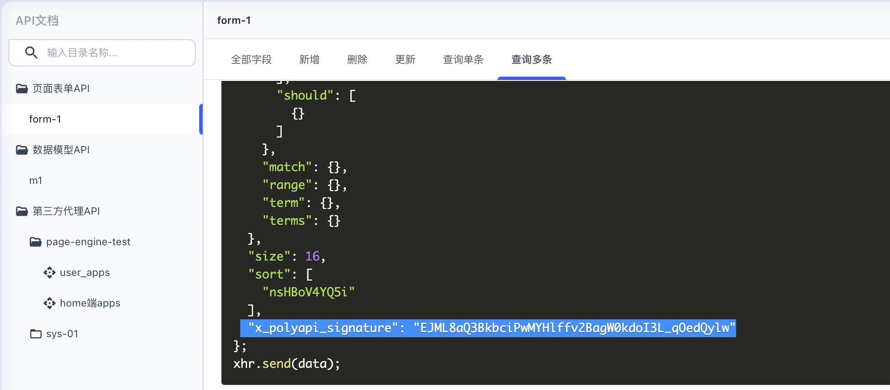
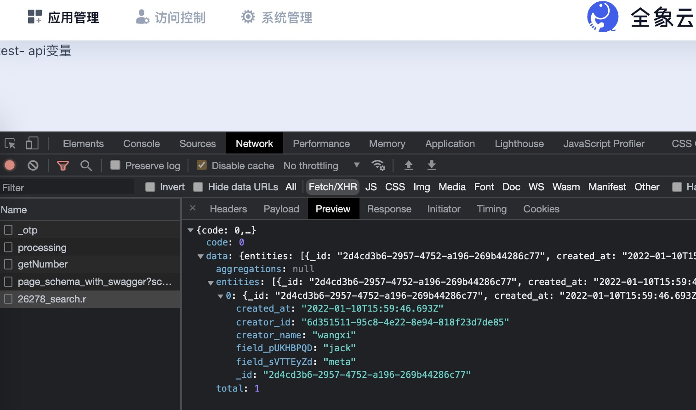
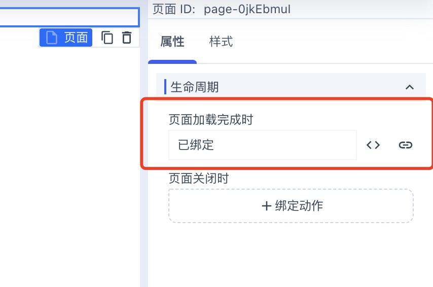
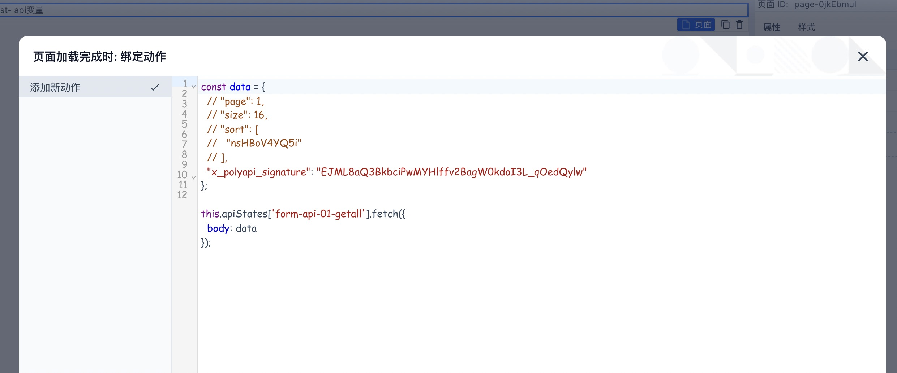
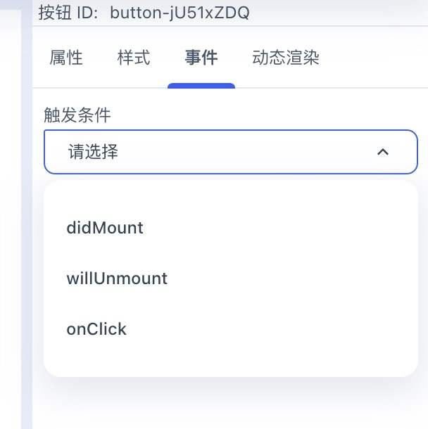
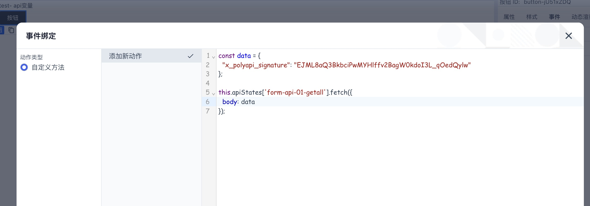

使用api变量
===

api变量在页面引擎中用于发送api请求和保持api请求的结果，api变量可以类似普通变量
被所有的组件共享使用，当组件消费某个api变量，其实是在使用api变量对应的api endpoint在发送请求之后拿到的结果。
(注：页面引擎依赖渲染引擎的api state hub，目前只支持平台内部的表单和数据模型api，第三方代理api)

## 1. 创建 api 变量
要使用api变量，首先需要创建api变量。点击 数据源 -> 切换到API 面板，点击 加号 按钮，就会看到
选择平台api的界面。





## 2. api state fetch方法
每个api state 都会自带两个方法: fetch, refresh，这两个方法是由渲染引擎的 api state hub暴露的。
要想引用某个api变量，就需要编写简单的JS表达式，我们去掉了完整函数的编写，只需要编写函数体的内容，例如

```js
const data = {
  // "page": 1,
  // "size": 16,
  // "sort": [
  //   "nsHBoV4YQ5i"
  // ],
  "x_polyapi_signature": "EJML8aQ3BkbciPwMYHlffv2BagW0kdoI3L_qOedQylw"
};

this.apiStates['form-api-01'].fetch({
  body: data
}, (result)=> {
  console.log('api result: ', result)
});
```

这里 `this.apiStates['form-api-01']` 就是对 名称为 `form-api-01`的api变量的引用，前提是 `form-api-01`这个数据源
已经在数据源面板的api变量里创建了，并且名称是一一对应的。

`this.apiStates` 的 `this` 是渲染引擎的context，这里this是由平台内部自动绑定的，用户只需要遵循这个约定去写即可。

每个 api变量 都会自带fetch方法，fetch函数的原型是:
```ts
type FetchParams = Partial<{ params: Record<string, any>; body: any; }>;
type APIFetchCallback = (state: Omit<APIState, 'loading'>) => void;

fetch(params: FetchParams, callback?: APIFetchCallback)
```

这里的意思是，fetch支持传入两个参数，第一个是请求参数params，第二个是请求完成后的回调函数(可选的)，
请求参数params一般包含 params, body 两个key，但是我们通常只需要定义body。

### 从 api文档获取对应 api的 签名参数

当按照上一步的 fetch函数写好了api请求的逻辑之后，还是不能获取最终数据，因为目前渲染引擎只支持平台内部的api，所有的请求要经过polyapi
网关的转发，这就需要拿到polyapi提供的签名数据

打开qxp-web的portal端，进到 数据管理 -> api文档，找到你当前使用的api变量对应的api文档的条目(你在选择平台api时 就能看到name，再去api文档的左侧导航里查找)。



拿到api的签名参数，就可以正常发送请求了



### 2.1 在 page lifecycle里使用 api 变量

在画布或者页面层级选中页面，右侧属性面板 生命周期里绑定动作，比如在页面加载完成时 绑定动作：



然后编写动作函数



### 2.2 在组件的事件面板绑定 api 变量

组件的事件面板也可以绑定动作 来发起api，每个组件都支持 didMount(加载完成),willUnmount(卸载) 这两个事件，其它动作是由该组件自身暴露的，
比如 按钮组件支持暴露 onClick 事件，下面以按钮的onClick为例





## api state refresh方法
todo


